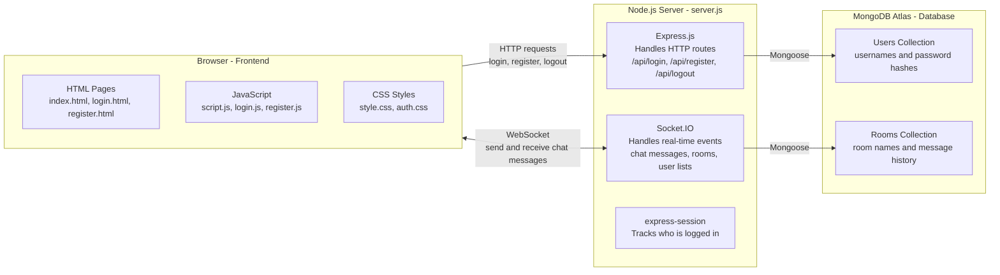
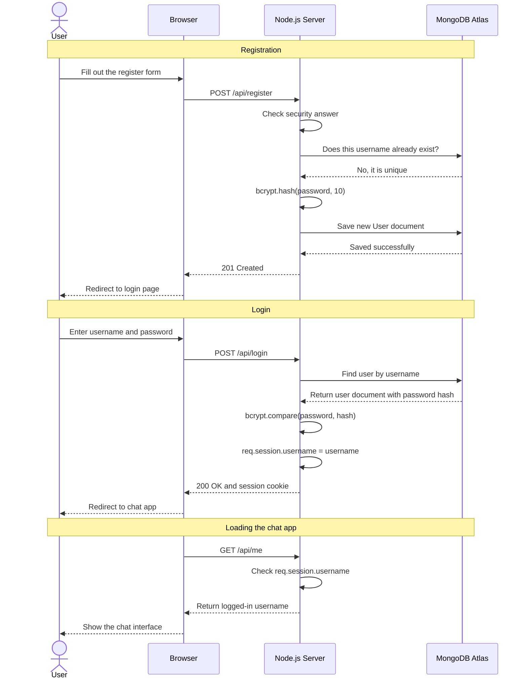
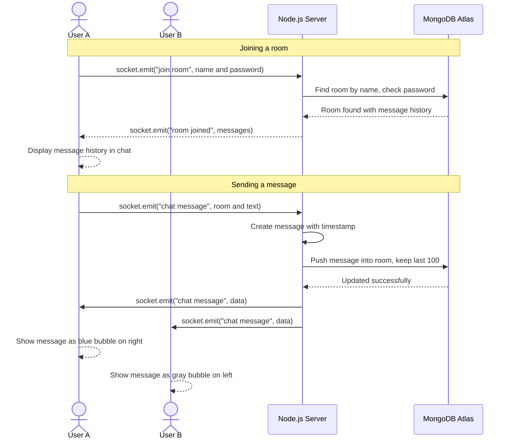
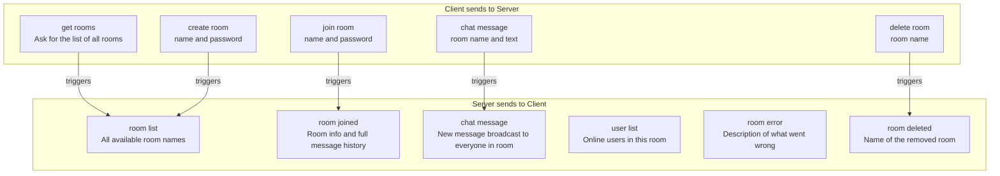
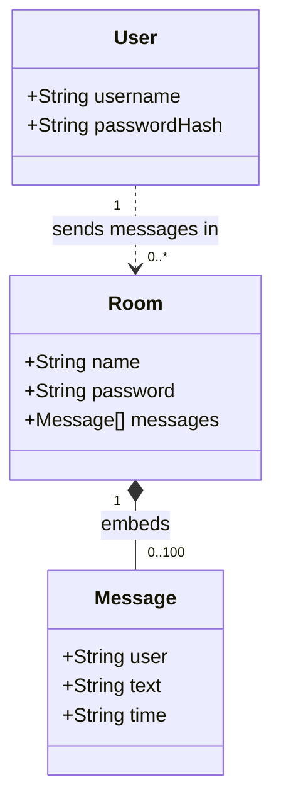

# Quantum-Link

> A real-time web chat application built with Node.js, Socket.IO, and MongoDB — created as a school project.


---

## What is Quantum-Link?

Quantum-Link is a full-stack, real-time chat application built as a school project to learn and demonstrate how modern web applications work. It lets users create an account, log in, join chat rooms, and exchange messages with other online users — all in real time, directly in the browser.

The project is intentionally written in a beginner-friendly style with clear, commented code that is easy to read, understand, and explain in a presentation.

### Features

- **User accounts** — Register and log in with a username and password
- **Multiple chat rooms** — Create public or password-protected rooms
- **Real-time messaging** — Messages appear instantly using Socket.IO (no page refresh needed)
- **Message history** — Up to 100 messages per room are saved in MongoDB
- **Online user list** — See who else is currently in the same room
- **Mobile-friendly** — The interface adapts to phones and tablets

---

## Technology Stack

Each technology below links to a beginner-friendly tutorial where you can learn more.

| Technology | What it does in this project | Learn More |
|---|---|---|
| **HTML** | Defines the structure and layout of every page | [MDN HTML Basics](https://developer.mozilla.org/en-US/docs/Learn/HTML) |
| **CSS** | Controls colors, fonts, layout, and the visual style | [MDN CSS Basics](https://developer.mozilla.org/en-US/docs/Learn/CSS) |
| **JavaScript** | Handles user interactions and updates the page in the browser | [javascript.info](https://javascript.info/) |
| **Node.js** | Runs JavaScript on the server (outside the browser) | [Node.js Introduction](https://nodejs.org/en/learn/getting-started/introduction-to-nodejs) |
| **Express.js** | Creates the web server and handles login/register routes | [Express Routing Guide](https://expressjs.com/en/guide/routing.html) |
| **Socket.IO** | Enables real-time two-way communication between browser and server | [Socket.IO Chat Tutorial](https://socket.io/get-started/chat) |
| **MongoDB Atlas** | Stores user accounts and chat room data in the cloud | [MongoDB University (free)](https://learn.mongodb.com/) |
| **Mongoose** | Connects Node.js to MongoDB and defines the data structure | [Mongoose Guide](https://mongoosejs.com/docs/guide.html) |
| **bcryptjs** | Scrambles passwords before storing them so they are never saved as plain text | [bcryptjs on npm](https://www.npmjs.com/package/bcryptjs) |
| **express-session** | Remembers which user is logged in between page requests | [express-session on npm](https://www.npmjs.com/package/express-session) |

---

## How the App Works

### Architecture Overview

The app is split into three layers that communicate with each other.



**In plain English:**
- The **browser** shows the interface and sends or receives data
- The **server** is the middle layer — it checks logins and routes all messages between users
- The **database** stores everything permanently so data survives a server restart

---

### How Authentication Works

When a user registers or logs in, a sequence of steps happens between the browser, server, and database.



**Key security ideas:**
- Passwords are **hashed** with bcrypt — even if the database were stolen, the real passwords would never be exposed
- A **session cookie** is set after login so the server remembers who you are across page requests
- Error messages are vague on purpose ("Incorrect username or password") so attackers cannot guess which part is wrong

---

### How Real-Time Chat Works

Real-time messaging uses **WebSockets** through Socket.IO. WebSockets are different from normal HTTP:
- HTTP is like sending a letter — you send, you wait, you get a reply
- WebSocket is like a phone call — the connection stays open and both sides can talk at any time



---

### Socket.IO Events Reference

Think of Socket.IO events like radio channels — both the client and server tune into the same channel name to send or receive data.



---

### Data Model

This is how data is structured and stored in MongoDB.



**Design notes:**
- `Message` objects are embedded directly inside each `Room` document (not a separate collection) — this keeps the code simple and all data in one place
- MongoDB automatically trims old messages so each room never stores more than 100
- Passwords are stored as a `passwordHash` — never as plain text

---

## File Structure

```
Quantum-Link/
├── public/                   ← All files sent to the browser
│   ├── index.html            ← Main chat app page (only visible after login)
│   ├── login.html            ← Login form
│   ├── register.html         ← Registration form
│   ├── script.js             ← Main chat app logic: Socket.IO, rooms, messages, UI
│   ├── login.js              ← Handles login form submission and errors
│   ├── register.js           ← Handles register form submission and validation
│   ├── style.css             ← Styles for the main chat interface
│   └── auth.css              ← Styles for the login and register pages
│
├── server.js                 ← The entire backend: Express routes + Socket.IO handlers
├── package.json              ← Project info and list of installed packages (dependencies)
├── .env                      ← Secret keys and database URL (never committed to git)
├── .gitignore                ← Files that git should ignore
└── render.yaml               ← Deployment settings for Render.com
```

---

## Key Code Concepts Explained

### 1. Connecting with Socket.IO

The browser opens a persistent connection to the server with a single line:

```js
// In script.js — opens a WebSocket connection to the server
const socket = io();
```

On the server, every new connection is handled like this:

```js
// In server.js — this function runs every time a new user connects
io.on("connection", (socket) => {
    console.log("A user connected:", socket.id);

    // Listen for events from this specific user...
    socket.on("chat message", (data) => { /* handle it */ });
});
```

---

### 2. Broadcasting Messages to a Room

There are three different ways to send events, each with a different scope:

```js
// Send only to the user who triggered the event (private reply)
socket.emit("chat message", data);

// Send to EVERYONE in a room, including the sender
io.to(roomName).emit("chat message", data);

// Send to everyone in a room EXCEPT the sender
socket.to(roomName).emit("chat message", data);
```

---

### 3. Password Hashing with bcrypt

Passwords are never stored as plain text. Instead, they are hashed — transformed into an unreadable string.

```js
// When a user registers — hash the password before saving it
const passwordHash = await bcrypt.hash(password, 10); // 10 = work factor (strength)
await User.create({ username, passwordHash });

// When a user logs in — compare the entered password to the stored hash
const isMatch = await bcrypt.compare(enteredPassword, user.passwordHash);
// isMatch is true if the password is correct, false if not
```

A bcrypt hash looks like this:
```
$2b$10$N9qo8uLOickgx2ZMRZoMyeIjZAgcfl7p92ldGxad68LJZdL17lhWy
```
It is impossible to reverse — you can only check if a new password matches it.

---

### 4. Session-Based Authentication

After login, the server saves the username in a session. This is how it remembers you are logged in across page requests.

```js
// After a successful login, save the username in the session
req.session.username = user.username;

// On every protected route, check if a session exists
app.get("/", (req, res) => {
    if (!req.session.username) {
        return res.redirect("/login.html"); // Not logged in, send away
    }
    res.sendFile(path.join(__dirname, "public", "index.html")); // Logged in, serve the app
});
```

---

### 5. Capping Message History in MongoDB

When a new message is saved, MongoDB automatically keeps only the most recent 100 — all in a single database operation.

```js
await Room.findOneAndUpdate(
    { name: roomName },                     // Find the room
    {
        $push: {
            messages: {
                $each: [newMessage],        // Add the new message
                $slice: -100                // Keep only the last 100
            }
        }
    }
);
```

---

## How to Run the Project

### 1. Install Dependencies

```bash
npm install
```

### 2. Create a `.env` File

Create a file named `.env` in the project root. This file holds secret values that should never be shared or committed to git.

```env
SESSION_SECRET=your_secret_key_here
MONGODB_URI=your_mongodb_atlas_connection_string
SECURITY_QUESTION=What is the secret word to join?
SECURITY_ANSWER=your_answer_here
```

> The `SECURITY_QUESTION` and `SECURITY_ANSWER` act as a gate — only people who know the answer can register a new account.

### 3. Start the Server

```bash
npm start
```

### 4. Open the App

Open your browser and go to:

```
http://localhost:3000
```

---

## Tutorial Resources

Use these free resources to learn more about each part of this project.

### HTML, CSS, and JavaScript
- [MDN Web Docs — HTML](https://developer.mozilla.org/en-US/docs/Learn/HTML) — The official guide to learning HTML structure
- [MDN Web Docs — CSS](https://developer.mozilla.org/en-US/docs/Learn/CSS) — Learn how to style web pages
- [javascript.info](https://javascript.info/) — A complete, beginner-friendly JavaScript course with interactive examples

### Node.js and Express
- [Node.js Official Learning Guide](https://nodejs.org/en/learn/getting-started/introduction-to-nodejs) — What Node.js is and how to use it
- [Express.js Routing Guide](https://expressjs.com/en/guide/routing.html) — How to create routes like `/api/login`

### Real-Time Messaging with Socket.IO
- [Socket.IO Official Chat Tutorial](https://socket.io/get-started/chat) — Build a real-time chat app from scratch using the same technology this project uses

### MongoDB and Mongoose
- [MongoDB University — Free Courses](https://learn.mongodb.com/) — Interactive, free MongoDB courses from the creators of MongoDB
- [Mongoose Getting Started Guide](https://mongoosejs.com/docs/guide.html) — How to define and use data models with Mongoose

### Full-Stack Learning Paths
- [The Odin Project](https://www.theodinproject.com/) — A free, structured path from complete beginner to full-stack developer
- [freeCodeCamp](https://www.freecodecamp.org/) — Free coding certifications covering HTML, CSS, JavaScript, Node.js, and more

---

## Educational Purpose

This project was built as a school project. The codebase prioritizes:
- Clear, readable code with comments explaining what each section does
- Simple patterns that are easy to understand and explain during a presentation
- A fully working app that demonstrates real full-stack development concepts
